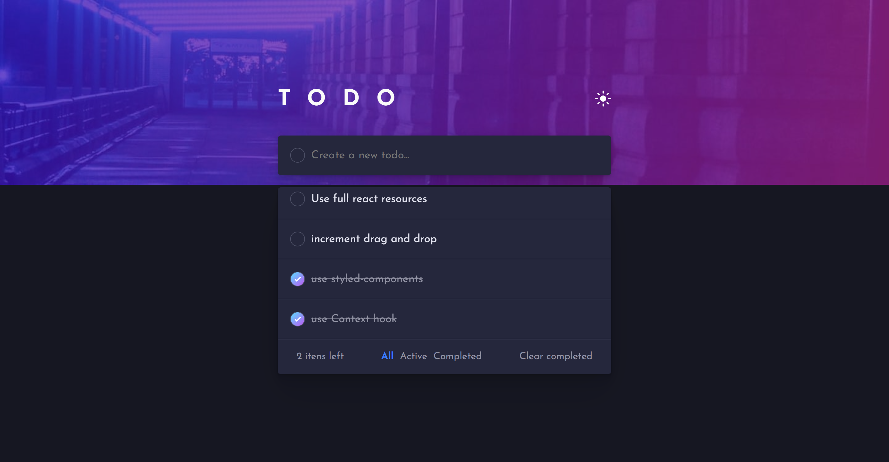
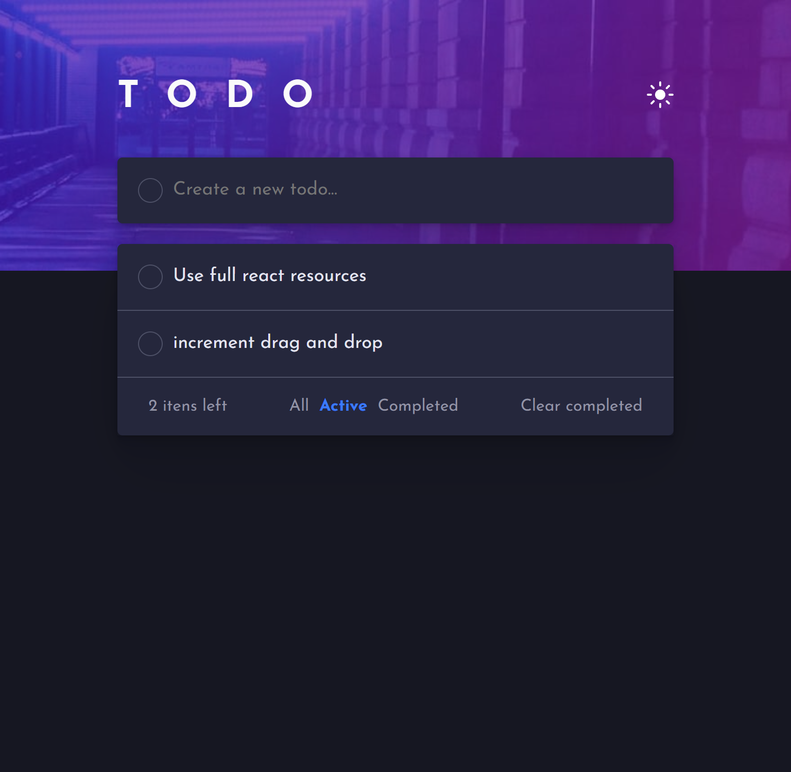
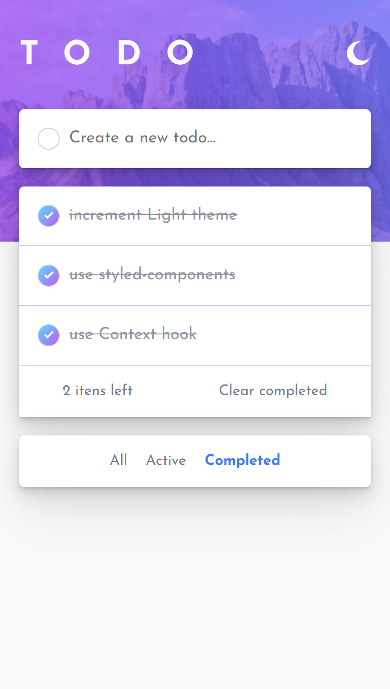

# Frontend Mentor - Todo app solution

This is a solution to the [Todo app challenge on Frontend Mentor](https://www.frontendmentor.io/challenges/todo-app-Su1_KokOW). Frontend Mentor challenges help you improve your coding skills by building realistic projects. 

## Table of contents

- [Overview](#overview)
  - [The challenge](#the-challenge)
  - [Screenshot](#screenshot)
  - [Links](#links)
- [My process](#my-process)
  - [Built with](#built-with)
  - [What I learned](#what-i-learned)
  - [Continued development](#continued-development)
- [Author](#author)
- [React](#react-run)

## Overview

### The challenge

Users should be able to:

- View the optimal layout for the app depending on their device's screen size
- See hover states for all interactive elements on the page
- Add new todos to the list
- Mark todos as complete
- Delete todos from the list
- Filter by all/active/complete todos
- Clear all completed todos
- Toggle light and dark mode

### Screenshot

- Desktop


- tablet


- Mobile


### Links

- Solution URL: [Front-end Mentor](https://your-solution-url.com)
- Live Site URL: [Netlify](https://your-live-site-url.com)

## My process

### Built with

- [React](https://reactjs.org/) - JS library
- [Styled Components](https://styled-components.com/) - For styles

### What I learned

- styled-component theme provider

```js
  background-color: ${props => props.theme.background1};
```

### Continued development

- make drag and drop function
- save tasks on backend

## Author

- Frontend Mentor - [@vini54](https://www.frontendmentor.io/profile/vini54)
- linkedin - [Vinícius Oliveira](https://www.linkedin.com/in/vin%C3%ADcius-oliveira-b3480a218/)
- github - [vini54](https://github.com/vini54)

## React run

This project was bootstrapped with [Create React App](https://github.com/facebook/create-react-app).

## Available Scripts

In the project directory, you can run:

### `npm start`

Runs the app in the development mode.\
Open [http://localhost:3000](http://localhost:3000) to view it in the browser.

The page will reload if you make edits.\
You will also see any lint errors in the console.

### `npm run build`

Builds the app for production to the `build` folder.\
It correctly bundles React in production mode and optimizes the build for the best performance.

The build is minified and the filenames include the hashes.\
Your app is ready to be deployed!

See the section about [deployment](https://facebook.github.io/create-react-app/docs/deployment) for more information.

### `npm run eject`

**Note: this is a one-way operation. Once you `eject`, you can’t go back!**

If you aren’t satisfied with the build tool and configuration choices, you can `eject` at any time. This command will remove the single build dependency from your project.

Instead, it will copy all the configuration files and the transitive dependencies (webpack, Babel, ESLint, etc) right into your project so you have full control over them. All of the commands except `eject` will still work, but they will point to the copied scripts so you can tweak them. At this point you’re on your own.

You don’t have to ever use `eject`. The curated feature set is suitable for small and middle deployments, and you shouldn’t feel obligated to use this feature. However we understand that this tool wouldn’t be useful if you couldn’t customize it when you are ready for it.